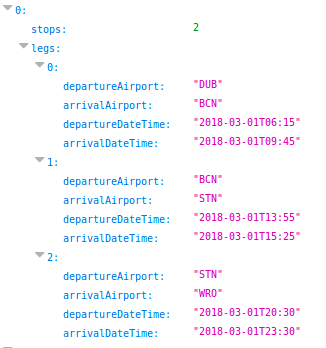

# Spring interconnections microservice

This microservice finds flight interconnections between
a source and a destination airport inside the provided time window.

It uses two other microservices:

https://api.ryanair.com/core/3/routes : provides a graph of valid routes between airports.

https://api.ryanair.com/timetable/3/schedules/ provides available flights between
two airports inside a given time window.

## Implementation

The service works with Spring Boot and makes use of Guava graphs. It also
uses the new time API from Java 8.

The main **InterconnectionsService** service finds available interconnections between the given
departure and arrival airports within a given time window. 

First the **RouteService** is used to find available paths between the origin and destination airports, only
flights between valid paths are useful. To find paths in the graph a utility **GraphUtils** is used that contains
a modified version of a recursive limited depth first search algorithm.

The route service is launched on context startup. After that it periodically calls the ryanair routes API
and then builds a graph with the retrieved routes. The graph is always available and updated on
memory so that path lookups are fast.

Once all valid paths between origin and destination are determined the **SchedulesService** 
is used to retrieve and transform all the available **Flights** for those paths that fall in the given time window.
To retrieve the **Flights** many calls are made asynchronously and in parallel to the ryanair schedules service. These
calls return **MonthSchedule** and **Flight** objects which are converted to **Leg** objects taking into account all
the timezone issues. For example some flights can arrive the day before or the day after departure in the destination timezone. They can even depart on one year and arrive the year before if they do it on the 1st of january and cross several timezones fast enough. 

The timezone for each airport is retrieved through a **TimeUtils** singleton that contains a map
from airport IATA codes to timezones. I got it from here:

https://raw.githubusercontent.com/hroptatyr/dateutils/tzmaps/iata.tzmap

Finally the **InterconnectionsService** joins all the legs into **Interconnection** objects that are returned
to the client.

## Highlights

- The code is general enough to handle interconnections with N stops not just 0 or 1 stops. Anything with more than one stop makes a lot of calls though. There is one test that demonstrates N=2 working, it only looks for routes within one day and it finds 9 or so in less than 30 seconds:

- The calls to the schedule API are asynchronous so that many schedules for many routes can be retrieved in paralell without
making the service wait for I/O.

## Limitations

- The time window is limited to a span of 30 days to avoid very big queries.

## Improvements

- The path finding algorithm is recursive. An iterative version would be faster
and use less memory.

- The calls to the schedules API can be cached, that would make the service faster for repetitive
or similar queries at the expense of some memory.
